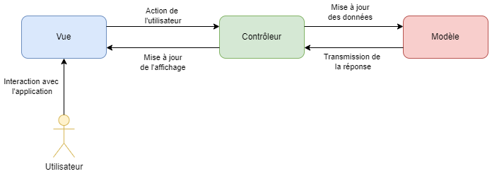
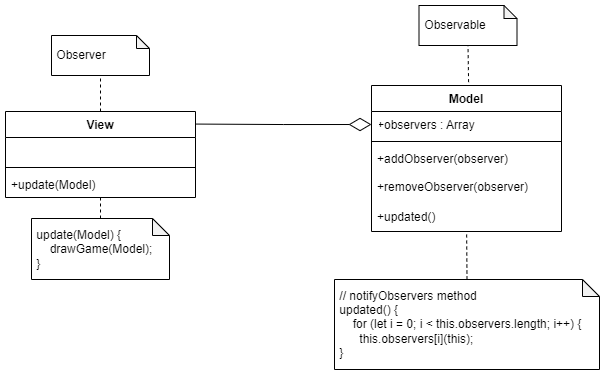

# ISI3 - MVC design pattern - "Game of Life"

> Le rapport est à fournir dans ce document sous chacune des questions.

> Ne copiez pas le code de votre voisin, ça se voit.

Nom/Prénom:
* `BERTRAND Adrien`
* `FERCHIOU Iskander`

Lien du codesandbox: `.......`

> Pour générer un codesandbox associé à votre code, [suivre cette doc](https://codesandbox.io/docs/importing#import-from-github).

Vous pouvez tester le code directement sur votre navigateur, à condition de lancer un serveur local. Par exemple :

```python3 -m http.server 8000```

Votre programme sera accessible depuis l'adresse `http://localhost:8000/index.html`.


## Game of Life

Le jeu de la vie est un automate cellulaire qui répond à des règles très simple.
Il a été inventé par [John Horton Conway](https://fr.wikipedia.org/wiki/John_Horton_Conway) (1937-2020).

## Avant-propos

1. Expliquer le design pattern MVC à l'aide d'un schéma à insérer directement ici.
Utiliser un outils comme Dia pour le représenter. Je veux **votre** schéma, pas un de ceux qu'on peut trouver sur le net.

Afin d'illustrer le fonctionnement du design pattern MVC, nous avons réalisé le schéma ci-dessous :

<p align="center">
    
</p>

Ici, l'utilisateur interagit uniquement avec la *Vue*. Le *Contrôleur* regroupe la partie logique métier et
joue le rôle d'intermédiaire entre la *Vue* et le *Modèle*. En effet, cette entité échange avec le *Modèle* afin de manipuler 
les données concernées par l'action de l'utilisateur et, en fonction de la réponse à la requête transmise, elle met à jour la *Vue*. 

3. Expliquer ce pattern en complétant ce texte.

Le pattern MVC, vise à découper le `modèle`, de la `vue` et du `contrôleur` afin de rendre le code plus `structuré`.
Les responsabilités ne sont alors plus `regroupées`.
On peut ainsi changer l'aspect visuel de son application sans pour autant impacter le `côté logique`.

3. Expliquer dans quels cas on doit privilégier le pattern MVC.

Il est conseillé de privilégier le pattern MVC lorsqu'on a besoin de structurer notre code de manière à le rendre plus facilement
maintenable et lisible. Dès qu'une application est composé d'une interface graphique et d'un ou plusieurs traitements "logique", 
appliquer ce pattern est une bonne idée pour que le programme soit plus modulaire. De cette manière, on sépare également la 
logique métier du code de présentation et on applique le principe SoC (Separation Of Concerns). Enfin, l'encapsulation apportée
par ce pattern cache la partie implémentation aux yeux de l'utilisateur, ce qui participe à la simplification de l'interface et à
la sécurisation de l'application.

## À faire (obligatoire)

- Rendre le jeu fonctionel tout en respectant le design pattern MVC.
- Le bouton `start` doit lancer le jeu.
- Le bouton `stop` doit arrêter le jeu en l'état, le `start` relance le jeu.
- le bouton `reset` arrête le jeu et remet à la grille à l'état initial.

### Observer Observable

Afin de mettre à jour la vue à chaque nouvelle génération du jeu, la fonction `updated` doit notifier la view afin qu'elle se mette à jour.
Cela relève du design pattern Observer/Observable.

1. Expliquer votre implémentation:

L'usage d'un callback permet ici de `notifier les observers` afin de dire à la _View_ de se redessiner.
L'objet _Model_ n'a pas de lien avec `View` pourtant grâce à la `méthode updated` il peut notifier la `vue`.

2. Insérer ici un UML montrant le pattern Observer/Observable lié aux objets de ce TP.

<p align="center">
    
</p>

## Optionnel

> Si vous voulez apprendre d'autres choses

- Faire en sorte de pouvoir changer les dimensions de la grille par un `<input/>` HTML.
- Faire en sorte de pouvoir modifier l'état d'une cellule en cliquant dessus.

## :warning: À rendre

- Une URL de codesandox pointant sur votre projet github afin que je puisse voir et tester le code.
- Le rapport complet.
